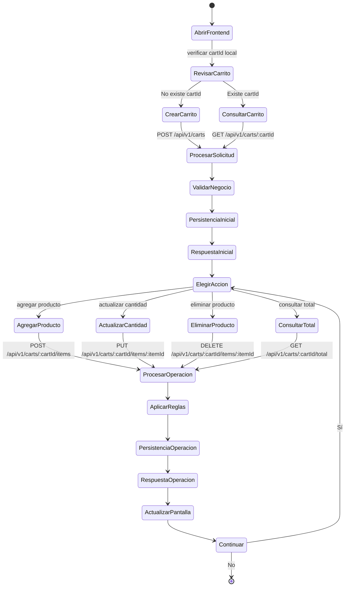

# Diagrama UML de Actividades

Este diagrama describe el flujo completo de gestión del carrito desde la UI hasta persistencia y respuesta.

## Diagrama

## Reglas clave del flujo

- Si el carrito no existe, primero se crea.
- Todas las operaciones pasan por gateway.
- El backend valida, ejecuta reglas de negocio y persiste cambios.
- El frontend refresca carrito y total después de cada operación.
