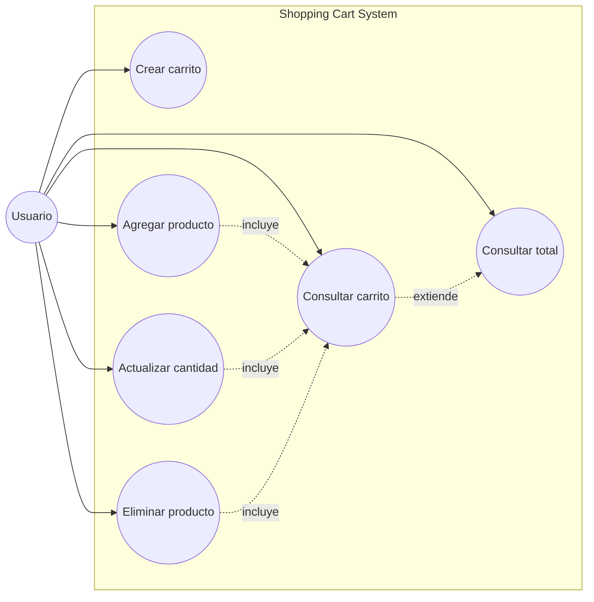

# Diagrama UML de Casos de Uso

Este diagrama resume los casos de uso efectivamente soportados por el sistema según la implementación actual (frontend + gateway + backend).

## Diagrama

## Alcance

- Actor principal: `Usuario`.
- Flujo de operación vía frontend consumiendo API Gateway.
- Casos alineados con HU-001 a HU-007.
