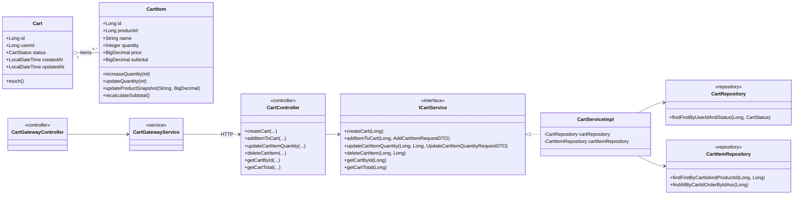

# Diagrama UML de Clases (Implementación Actual)

Este diagrama refleja las clases principales que hoy existen en backend y gateway.

## Diagrama

## Notas

- El dominio principal está en `Cart` y `CartItem`.
- El gateway no implementa lógica de negocio de carrito, solo enruta hacia backend.
- Los DTOs fueron omitidos para mantener el diagrama legible, aunque sí están implementados.
