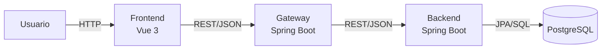
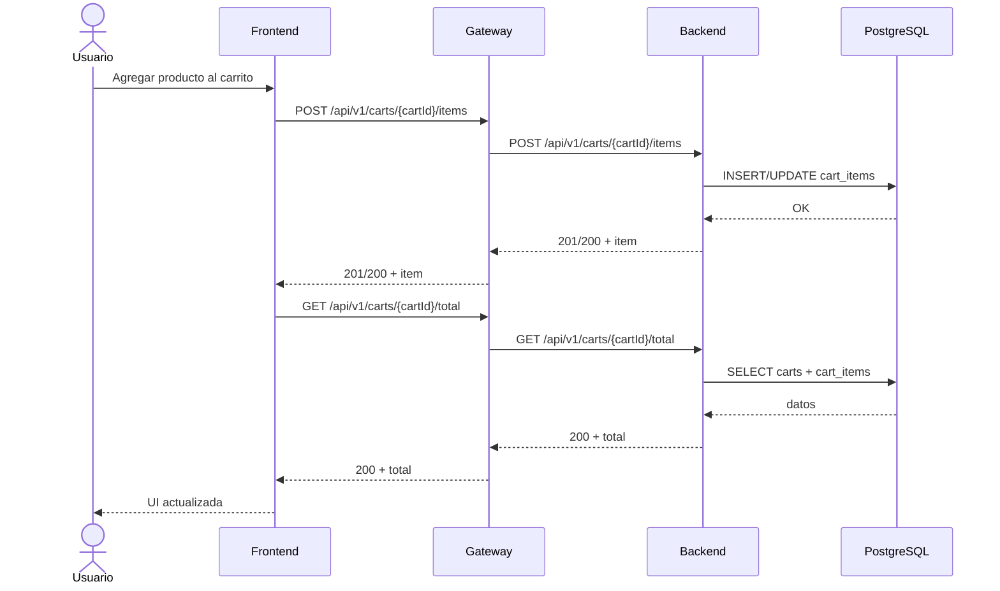

# Diagrama UML de Contexto y Secuencia

Este documento muestra el contexto técnico real y el flujo de una operación típica en la arquitectura actual.

## 1. Diagrama de Componentes (UML)

## 2. Diagrama de Secuencia (UML)

Escenario: agregar producto y consultar total actualizado.

## 3. Resumen

- El frontend no consume el backend directamente.
- El gateway centraliza acceso, validaciones de borde y enrutamiento.
- El backend concentra reglas de negocio del carrito.
- PostgreSQL persiste estado y permite reconstruir totales en cada consulta.
