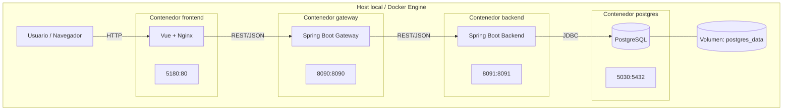

# Diagrama UML de Despliegue

Este diagrama muestra el despliegue actual del sistema en contenedores Docker y los puertos expuestos en el host.

## Diagrama

## Puertos activos

- Frontend: `http://localhost:5180`
- Gateway: `http://localhost:8090`
- Backend: `http://localhost:8091`
- PostgreSQL: `localhost:5030`

## Notas

- El frontend consume únicamente al gateway.
- El gateway enruta operaciones hacia backend.
- El backend persiste datos en PostgreSQL.
- El volumen `postgres_data` conserva la información de la base entre reinicios.
