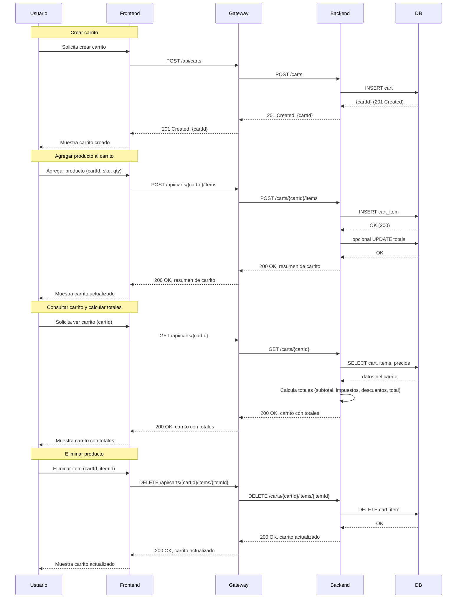

## Diagrama de Secuencia — Flujo del Carrito de Compras

Descripción: diagrama de secuencia Mermaid que muestra los flujos principales: crear carrito, agregar producto y consultar el carrito/calcular totales.

Notas:
- Los endpoints muestran el contrato público entre Frontend y Gateway; Gateway enruta al Backend.
- El cálculo de totales puede realizarse en el Backend leyendo precios actuales desde la base de datos y aplicando reglas de negocio (impuestos, descuentos, promociones).
